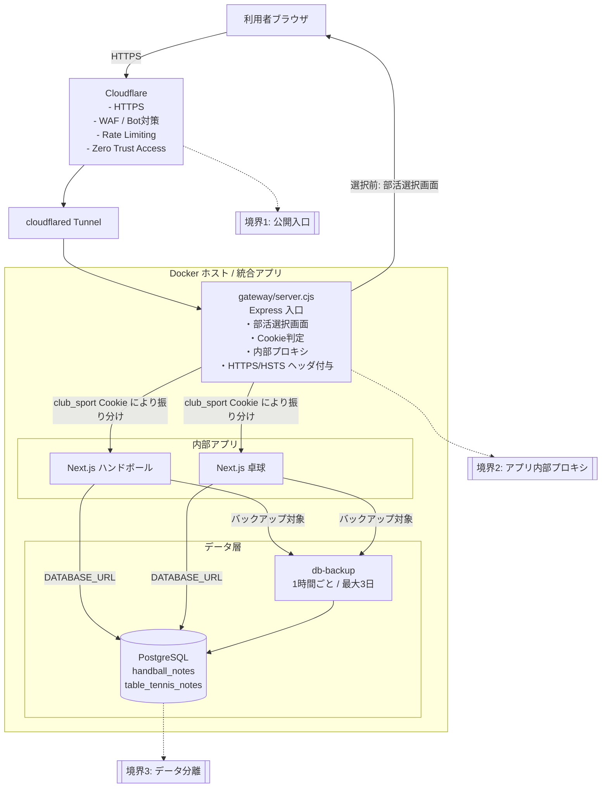

# システム構成図

このプロジェクトは、ハンドボールアプリと卓球アプリを 1 つの入口に統合し、選択した部活ごとに認証・DB・セッションを分離する構成です。

## 構成図

## セキュリティ観点の要点

1. 外部公開は Cloudflare Tunnel 経由を前提にし、オリジンサーバーを直接公開しません。
2. ゲートウェイは `X-Forwarded-Proto` を見て HTTPS を強制し、`Strict-Transport-Security` などの基本ヘッダを付与します。
3. `club_sport` Cookie で部活を分離し、`hbn_member_session` と `ttn_member_session` でセッションを分けています。
4. PostgreSQL は `handball_notes` と `table_tennis_notes` に分離し、誤参照や横展開のリスクを下げています。
5. 管理系は `HANDBALL_ADMIN_VIEW_KEY` / `TABLE_TENNIS_ADMIN_VIEW_KEY` と、追加の `SUPER_ADMIN_LOGIN_PASSWORD` で保護します。
6. 管理画面は Cloudflare Zero Trust Access と Rate Limiting を重ねる前提です。
7. バックアップは競技ごとに分離し、長期保持しすぎないよう 72 世代でローテーションします。

## 通信の流れ

1. ブラウザが Cloudflare に HTTPS でアクセスします。
2. Cloudflare Tunnel がホスト上のゲートウェイへ転送します。
3. ゲートウェイで部活未選択なら選択画面を表示し、選択済みなら該当アプリへ内部プロキシします。
4. 各アプリは自分の DB にのみ接続し、必要に応じてバックアップ対象になります。

## 補足

- この図は、ローカル Docker 運用と Cloudflare 公開運用の両方を含めて表現しています。
- 図中の境界は、そのままセキュリティレビューの観点にも使えます。